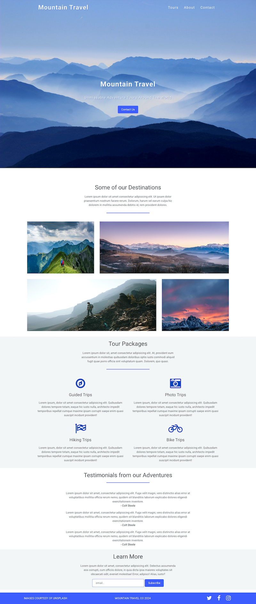

# Mountain Travel Landing Page

This is an excersise from The Advanced Web Development Course to build a basic landing page for a travel company, utilising plain CSS with flexbox, mobile first and responsive design.

### Screenshot

